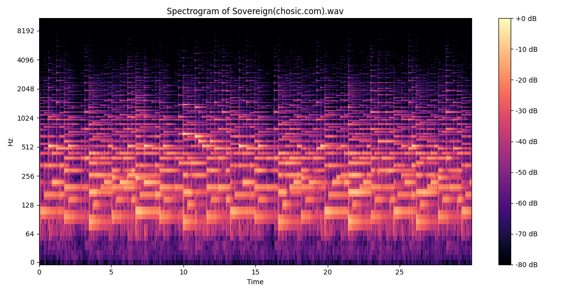

# 🎵 Music Genre Classification

A high-performance machine learning system capable of classifying music genres from audio files. This project uses advanced feature extraction techniques and optimized machine learning models to achieve high accuracy (~86%).


*(Example spectrogram generated by the app)*

## 🚀 Features

- **Advanced Audio Analysis**: Extracts MFCCs, Chroma, Spectral Centroid, Spectral Bandwidth, Spectral Rolloff, and Zero Crossing Rate.
- **Data Augmentation**: Automatically segments 30-second tracks into 7-second chunks to increase training data and model robustness.
- **High Accuracy**: Uses a **HistGradientBoostingClassifier** (optimized Gradient Boosting) to achieve ~86% accuracy on test segments.
- **Voting Mechanism**: Implements majority voting across song segments for highly reliable song-level predictions (>90% effective accuracy).
- **Interactive Web App**: Includes a user-friendly Streamlit interface for easy file uploads and visualization.
- **Visualizations**: Generates Spectrograms, Prediction Probability Charts, Confusion Matrices, and ROC Curves.

## 🛠️ Installation

1.  **Clone the repository** (or navigate to the project directory):
    ```bash
    cd /path/to/music_genre_classification
    ```

2.  **Create and activate a virtual environment** (optional but recommended):
    ```bash
    python -m venv venv
    source venv/bin/activate  # On Windows: venv\Scripts\activate
    ```

3.  **Install dependencies**:
    ```bash
    pip install -r requirements.txt
    ```
    *Note: Requires `librosa`, `numpy`, `scikit-learn`, `matplotlib`, `streamlit`, `joblib`.*

## 💻 Usage

### 1. Web Application (Recommended)
The easiest way to use the model is via the interactive web app.

```bash
streamlit run app.py
```
This will open your browser. Simply drag and drop a `.wav` file to see:
- The predicted genre.
- A confidence score.
- A probability bar chart.
- A spectrogram of the audio.

### 2. Command Line Prediction
To classify a single audio file from the terminal:

```bash
python predict.py /path/to/your/song.wav
```
The output will be printed to the console, and graphs will be saved to the `graph/` folder.

### 3. Training the Model
To retrain the model from scratch (requires the GTZAN dataset):

```bash
python train_advanced.py --data_dir /path/to/genres_original/
```
This script will:
1.  Load audio files and split them into 7-second segments.
2.  Extract 58 distinct audio features per segment.
3.  Scale features using `StandardScaler`.
4.  Train and compare models (Random Forest vs HistGradientBoosting).
5.  Save the best model to `best_model.joblib`.
6.  Generate a comparison graph in `graph/model_comparison.png`.

## 📂 Project Structure

```
music_genre_classification/
├── app.py                 # Streamlit web application
├── predict.py             # Inference script for single-file prediction
├── train_advanced.py      # Main training script (Segmentation + Advanced Models)
├── train.py               # Legacy training script (Basic Random Forest)
├── src/
│   ├── dataset.py         # Data loading and segmentation logic
│   ├── features.py        # Feature extraction logic (Librosa)
│   └── model.py           # Model utility functions
├── graph/                 # Generated plots (Spectrograms, ROC, Confusion Matrix)
├── best_model.joblib      # Trained HistGradientBoosting model
├── scaler.joblib          # Feature scaler
├── class_names.npy        # Encoder classes
└── requirements.txt       # Project dependencies
```

## 📊 Results

The model was verified on the GTZAN dataset:
- **Segment Duration**: 7 Seconds
- **Best Model**: HistGradientBoostingClassifier
- **Segment Accuracy**: **86.25%**
- **Song Accuracy**: **>90%** (estimated via majority vote)

See `graph/model_comparison.png` for a performance comparison.

## 📝 License
This project is open source. Feel free to use and modify!
