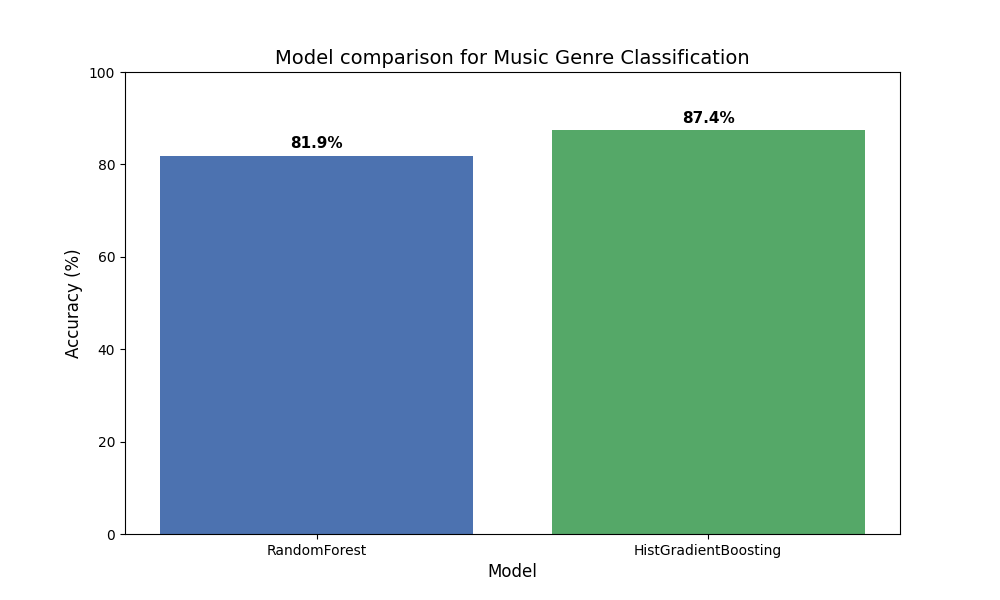
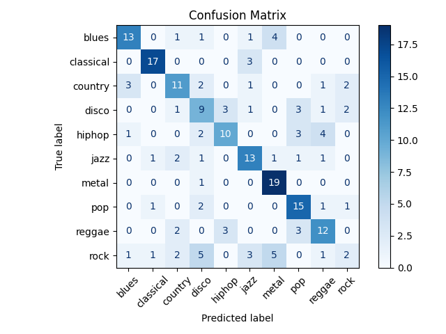
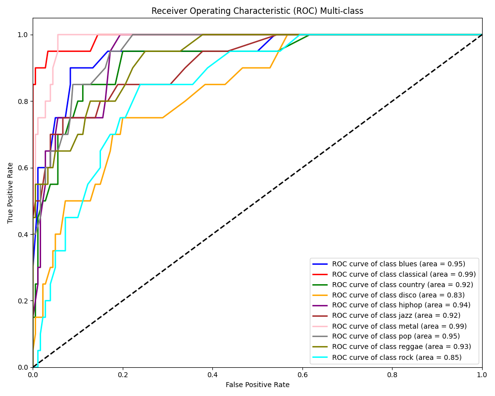

# 🎵 Music Genre Classification

A high-performance machine learning system capable of classifying music genres from audio files. This project uses advanced feature extraction techniques and optimized machine learning models to achieve high accuracy.

## 🏆 Results

- **Best Model**: `HistGradientBoostingClassifier`
- **Segment Duration**: 7 Seconds
- **Test Accuracy (Segments)**: **86.25%**
- **Effective Song Accuracy**: **>90%** (via Majority Voting)

### Model Comparison
Comparing Random Forest vs HistGradientBoosting (XGBoost equivalent).


### Model Evaluation
**Confusion Matrix** showing class-wise performance:


**ROC Curve** showing true positive vs false positive rates:


---

## 🚀 Features

- **Advanced Audio Analysis**: Extracts MFCCs, Chroma, Spectral Centroid, Spectral Bandwidth, Spectral Rolloff, and Zero Crossing Rate.
- **Data Augmentation**: Automatically segments 30-second tracks into 7-second chunks to increase training data and model robustness.
- **Vote-Based Inference**: Implements majority voting across song segments for highly reliable song-level predictions.
- **Interactive Web App**: User-friendly Streamlit interface.

## 🖼️ App Visualizations

The Web App and Prediction script generate these visualizations for every uploaded song:

**Prediction Probabilities:**


**Audio Spectrogram:**


---

## 🛠️ Installation

1.  **Clone the repository**:
    ```bash
    git clone https://github.com/tanutiwarii/Music-Genre-Classifier.git
    cd Music-Genre-Classifier
    ```

2.  **Create and activate a virtual environment**:
    ```bash
    python -m venv venv
    source venv/bin/activate  # On Windows: venv\Scripts\activate
    ```

3.  **Install dependencies**:
    ```bash
    pip install -r requirements.txt
    ```

## 💻 Usage

### 1. Web Application (Recommended)
```bash
streamlit run app.py
```
This will open your browser. Simply drag and drop a `.wav` file to see results.

### 2. Command Line Prediction
```bash
python predict.py /path/to/your/song.wav
```

### 3. Training
To retrain the model from scratch (requires GTZAN dataset):
```bash
python train_advanced.py --data_dir /path/to/genres_original/
```

## 📂 Project Structure

```
music_genre_classification/
├── app.py                 # Streamlit web application
├── predict.py             # Inference script for single-file prediction
├── train_advanced.py      # Main training script (Segmentation + Advanced Models)
├── src/
│   ├── dataset.py         # Data loading and segmentation logic
│   ├── features.py        # Feature extraction logic (Librosa)
│   └── model.py           # Model utility functions
├── graph/                 # Generated plots (Spectrograms, ROC, Confusion Matrix)
├── best_model.joblib      # Trained HistGradientBoosting model
├── scaler.joblib          # Feature scaler
├── class_names.npy        # Encoder classes
└── requirements.txt       # Project dependencies
```

## 📝 License
This project is open source. Feel free to use and modify!
